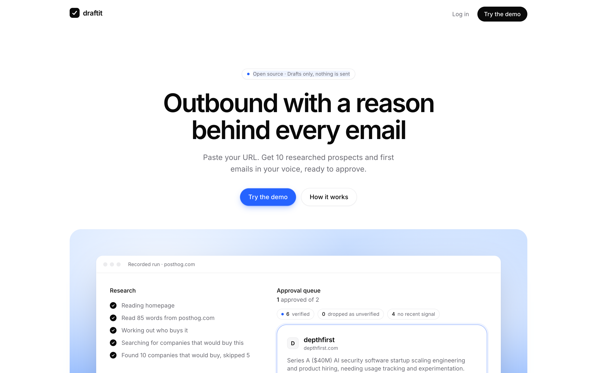
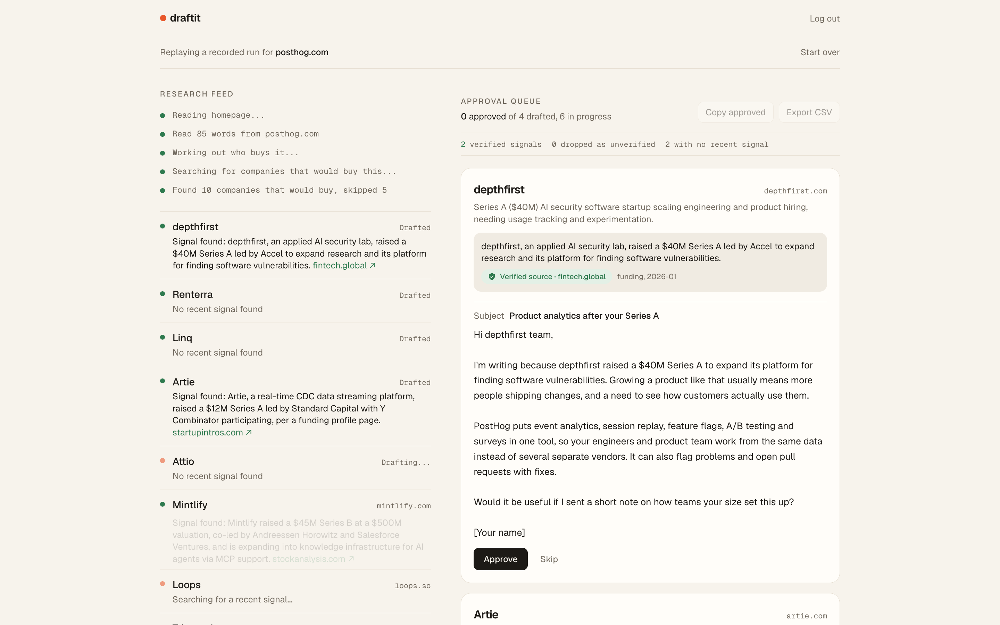
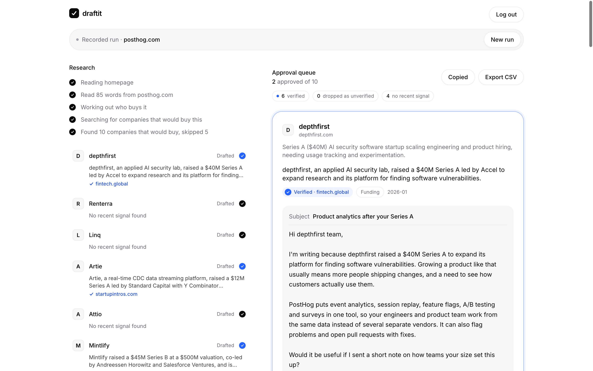
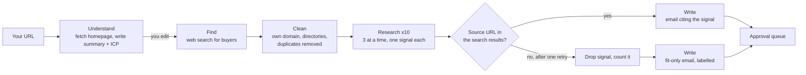

# draftit

**Paste your URL. Get 10 researched prospects and first emails in your voice, ready to approve.**



## Why

For a small team, outbound is the hardest part of growth. You have to work out who to email, find a reason to email them now, and write something that does not read like spam, ten times a week, on top of building the product.

Tools that write the emails for you mostly make this worse. Their emails get ignored because they are not grounded in anything real: a vague compliment, a guessed pain point, a "saw you are growing" that could be sent to anyone. Or worse, a confident fact that is not true.

draftit only writes about things it can point to.

## What it does

1. **Understand.** Reads your homepage and writes a short summary of what you sell and who buys it: company type, size, and the signals that mean someone needs it now. You can edit both before it continues.
2. **Find.** Searches the web for about 10 real companies that would *buy* your product. Not competitors, not look-alikes, not listicles or directories.
3. **Research.** For each company, looks for one concrete, recent "why now" signal: a hiring post, a funding round, a launch, an expansion, a change in their stack. Every signal carries the URL it came from.
4. **Verify.** Checks that URL against what the search actually returned. See [the verified-source rule](#the-verified-source-rule).
5. **Write.** Drafts a short first email (under 120 words) that cites the signal, in your voice if you paste a few things you have written. Company-level only: it never looks up or writes people's names or email addresses, and addresses "the team" or a role.
6. **Approve.** Every draft lands in a queue. Edit it inline, approve it or skip it, then copy the approved emails or export them as CSV. Nothing is sent.

The research streams live into the page as it happens, so you can watch each company go from searching to a signal to a draft.





## How it works



Each step is one model call (or a short search loop) with a typed output validated by zod. The search steps give the model a web search tool plus a `submit` tool for the structured answer; the loop resumes paused searches and asks once more if the model stops without submitting. Searches are capped per step (5 to find companies, 3 per company), so a run stays bounded.

The homepage fetch refuses private and loopback addresses, checks every resolved IP on the socket it connects with, follows at most 3 redirects, and stops at 1 MB or 8 seconds.

## The verified-source rule

A signal only reaches an email if its source URL is one the web search tool actually returned for that company. The check uses the URLs in the search result blocks of the API response, not URLs the model typed into its answer.

- **Verified:** the cited URL matches a retrieved URL (ignoring scheme, `www`, trailing slash, fragment and `utm_` parameters; the path and the rest of the query must match). The card shows a green **Verified source** chip that links to it.
- **Not verified:** the model is told the URL was not in its results and gets one retry. If it still cannot cite a retrieved URL, the signal is dropped, the email is written from fit alone, and the card says so. Dropped signals are counted on screen next to the verified ones. They are never hidden.
- **Nothing found:** the email is written from fit alone and labelled "No recent signal". It does not pretend to know anything recent.

Why it matters: there is no black box to trust. Every claim in an email has a link you can click before you hit send, and the system is built so it cannot quietly invent one. The check is a small pure function (`verifySignal` in `lib/checks.ts`) with tests.

What it does not prove: that the page says exactly what the summary claims. It proves the page was really found. Click the chip before you send.

## Quickstart

```bash
npm install
cp .env.example .env   # add ANTHROPIC_API_KEY for live runs
npm run dev            # http://localhost:3000
```

Log in with the demo account shown on the login page (`demo@draftit.dev` / `draftit`). Without an API key the app replays a real recorded run (`data/demo-run.json`); with one, it runs live on any URL. There is also a "watch a recorded demo run" link either way.

From the terminal:

```bash
npm run draft -- https://yourstartup.com
npm run draft -- https://yourstartup.com --voice samples.txt
```

This prints the whole run and writes it to `runs/<domain>.json` in the same format as the demo fixture.

```bash
npm test        # verification, domain cleanup and text checks
npm run build
```

## Configuration

| Variable | Required | What it does |
| --- | --- | --- |
| `ANTHROPIC_API_KEY` | For live runs | Without it, the app only replays the recorded demo run. |
| `DRAFTIT_MODEL` | No | Model id used for every step. Default in `.env.example`. |
| `ANTHROPIC_WORKSPACE_ID` | No | Only for an org-wide API key that is not scoped to a workspace. |
| `DEMO_ACCESS_TOKEN` | Outside `next dev` | Live runs spend credits and fetch URLs, so a deployment needs this. Open the app with `?token=<value>`. Without it, deployments are demo-only. |
| `DEMO_EMAIL`, `DEMO_PASSWORD` | No | The shared demo login. Defaults to `demo@draftit.dev` / `draftit`. |

The login is a demo gate, not real auth: one shared account and an httpOnly cookie, so the app has a front door. The token above is what actually protects the API key.

## Cost and speed

Measured on real runs: about 100 seconds and about $1 per run of 10 companies, with 20 to 25 web searches. Every API call logs its token usage and estimated cost to the server console (`[draftit cost]`).

## Honest limits

- **Company-level only.** It does not find people, names or email addresses, on purpose. You still need to know who to send to.
- **No sending.** It drafts and exports. Sending, follow-ups and replies are up to you.
- **Search quality varies.** Some runs pick companies that are larger than ideal, or that already use the product. Small companies often have no recent public signal, and then you get a fit-only email. Signals sometimes come from data aggregators rather than primary sources.
- **Verified means found, not true.** The rule guarantees the source page was really retrieved. It does not check that the summary matches the page word for word.
- **JavaScript-heavy homepages** give it less to read. You can fix the summary by hand before it searches.

## What I'd build next

- **Reply handling:** read replies and draft the follow-up, with the same approval step.
- **Send through your own inbox,** with approval per email, so nothing goes out you have not seen.
- **Learn from approve and skip:** use your decisions to pick better companies and write closer to how you edit.
- **LinkedIn drafts:** a short connection note alongside each email, grounded in the same signal.

## License

MIT
